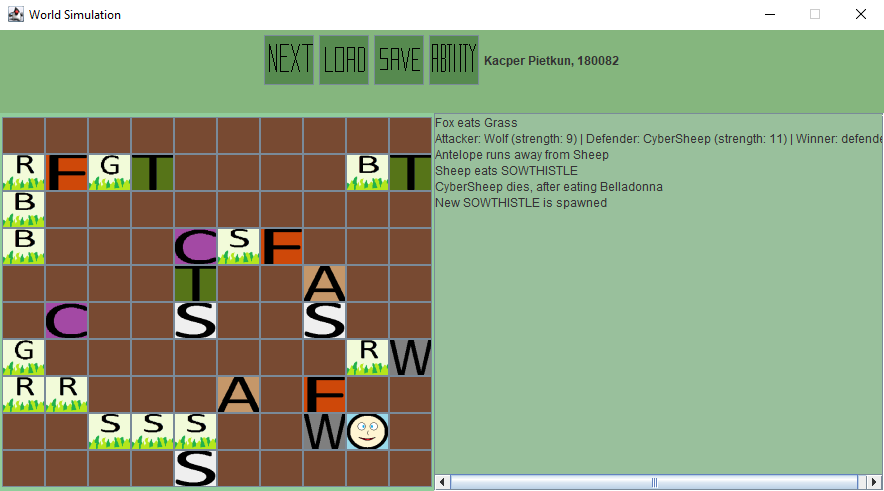

# World Simulator

## Sections

 - [Visuals](#visuals)
 - [Description](#description)
	 - [General](#general)
   - [Game Legend](#game-legend)
   - [Main Features](#main-features)
   - [Human](#human)
   - [Animals](#animals)
   - [Plants](#plants)
	- [Programming languages and libraries](#programming-languages-and-libraries)
 - [Usage](#usage)

## Visuals

## Description

### General
University project. Simulator of the world (animals and plants)

### Game Legend
 - W - WOLF
 - S - SHEEP
 - F - FOX
 - T - TURTLE
 - A - ANTELOPE
 - C - CYBER-SHEEP
 - G - GRASS
 - O - SOWTHISTLE
 - N - GUARANA
 - B - BELLADONNA
 - E - HOGWEED
 - :) - HUMAN
 
 ### Main Features
 - Game is turn-based
 - Each organism occupy only one field
 - World is two-dimensional (height and width is defined by user input)
 - Human is controlled by user with arrow keys
 - User can activate human's special ability (with 'ability' button)
 - Game can be saved to file (with 'save' button) and loaded (with 'load' button)
 - Detailed report of every event is printed to the console after every round
 - Plants can propagate
 - Animals can eat plants
 - Animals can fight with each other (only with different kind of an animal)
 - Animals can breed when interacting with the same kind of an animal
 - Strength of animals decides about the result of the fight
 - Initiative decides who is going to make his move first, if initiative is equal then older organisms make their move (initiative of plants is equal 0)
 
 ### Human
| Strength | Inititative | Action                             | Special ability                                                |
|----------|-------------|------------------------------------|----------------------------------------------------------|
| 5        | 4           | user chooses direction of the move | antelope speed - Human moves one field further for the next three rounds. During 4th and 5th round human has got 50% chance to move one field futher |

 ### Animals

| Animal      | Strength | Inititative | Action                                                                                                                                 | Collision                                                                                 |
|-------------|----------|-------------|----------------------------------------------------------------------------------------------------------------------------------------|-------------------------------------------------------------------------------------------|
| wolf        | 9        | 5           | none                                                                                                                                   | none                                                                                      |
| sheep       | 4        | 4           | none                                                                                                                                   | none                                                                                      |
| fox         | 3        | 7           | won't move to the field with an animal with higher strength                                                                            | none                                                                                      |
| turtle      | 2        | 1           | 75% chance of not moving                                                                                                               | Resists attacks of attack with strength < 5. Attacker must come back to its initial field |
| antelope    | 4        | 4           | move range is 2                                                                                                                        | 50% chance of fleeing before fight - then move to the nearby empty field                  |
| cyber-sheep | 11       | 4           | If there is a hogweed on the map then cyber-sheep always moves to the nearest one. If there is no hogweed it behaves like normal sheep | eats hogweed                                                                              |

 ### Plants

| Plant      | Strength | Action                                        | Collision                                                |
|------------|----------|-----------------------------------------------|----------------------------------------------------------|
| grass      | 0        | none                                          | none                                                     |
| sowthistle | 0        | 3 attemps of propagation in 1 turn            | none                                                     |
| guarana    | 0        | none                                          | Increases animal's strength by 3                         |
| belladonna | 99       | none                                          | Eating it results in animal's death                      |
| hogweed    | 10       | kills all nearby animals (except cyber-sheep) | Eating it results in animal's death (except cyber-sheep) |

## Programming languages and libraries
- Java
- Swing

## Usage
 - University project
 - playing the game
 - Practicing object-oriented programming
